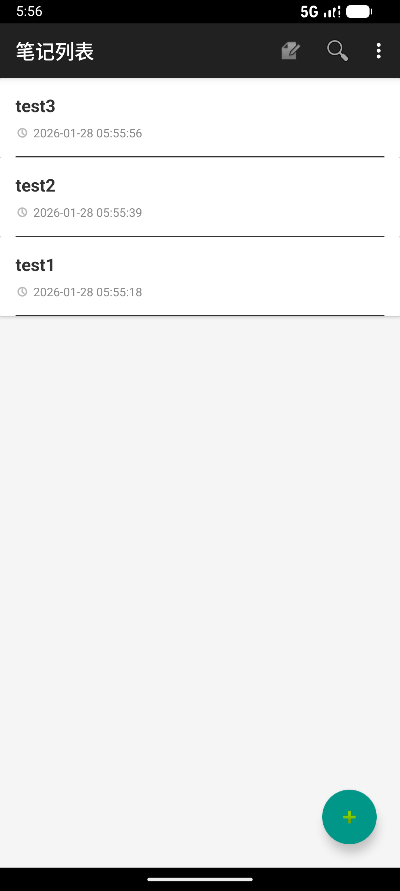
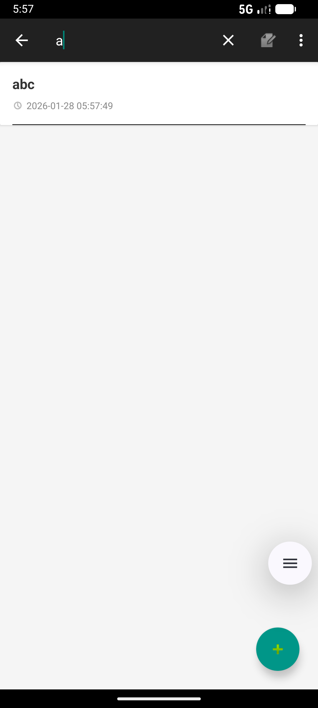
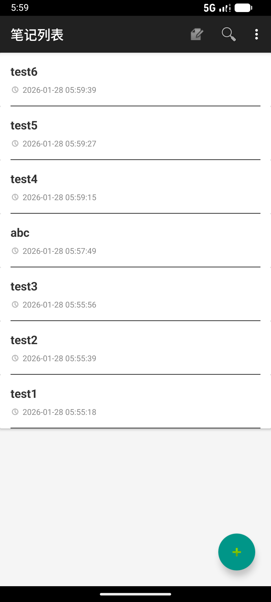
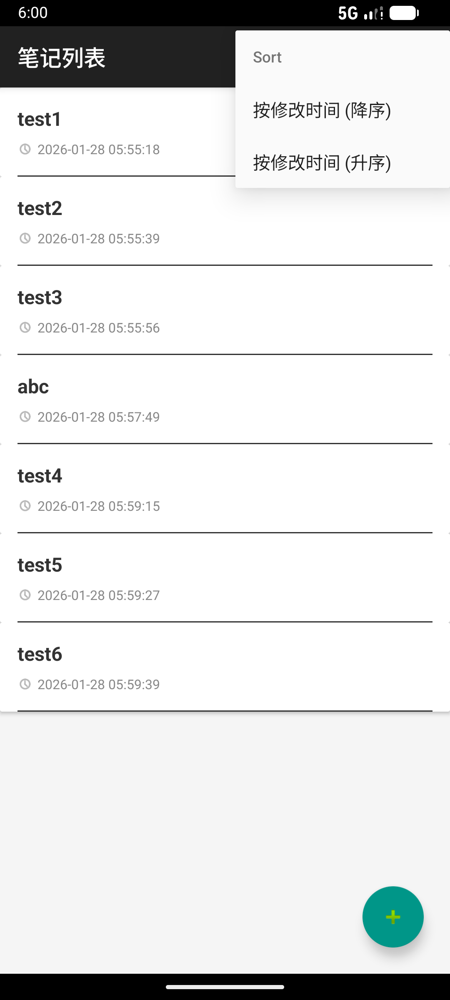
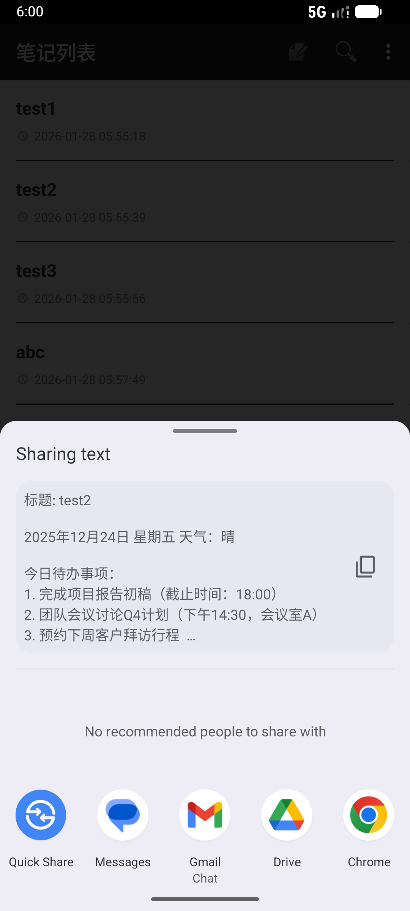
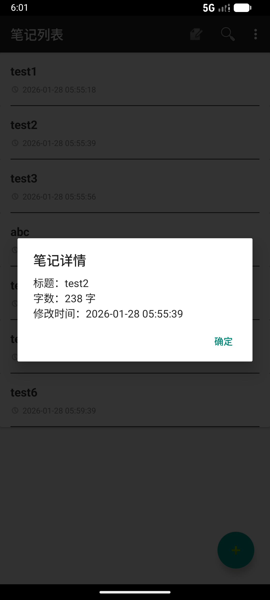
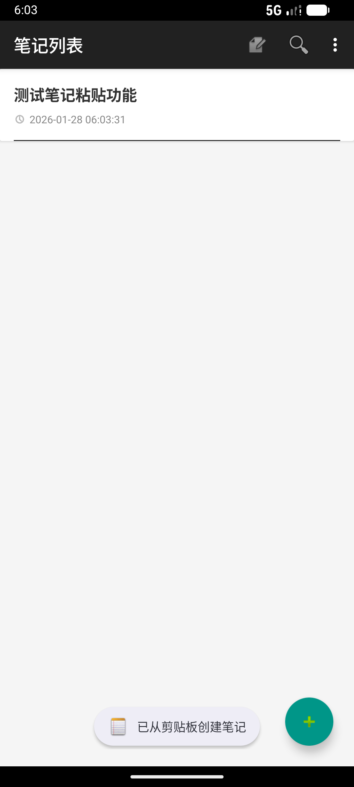
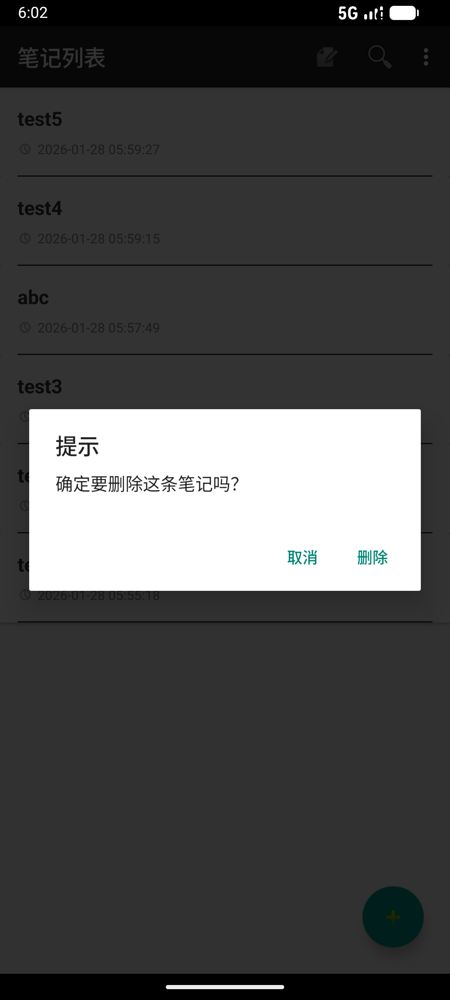

# Android NotePad 应用功能扩展实验

## 项目概述

本项目是基于 Google Android SDK 提供的经典 NotePad 示例应用进行的二次开发。在保留原有核心功能的基础上，完成了从 Support 库到 AndroidX 的迁移，并根据实验要求扩展了搜索、时间戳显示等基础功能，同时对 UI 进行了现代化卡片化美化，大幅增强了用户交互体验。

**项目特点：**
- ✅ 全面迁移至 AndroidX 支持库
- ✅ 采用 Material Design 设计规范
- ✅ 兼容 Android 7.0 (API 24) 及以上版本
- ✅ 修复了原版代码中的多个稳定性问题

---

## 开发环境与技术栈

### 开发环境
- **Android Studio**：Android Studio Hedgehog | 2023.1.1
- **Compile SDK**：34 (Android 14)
- **Min SDK**：24 (Android 7.0)
- **Target SDK**：34

### 核心依赖库
```gradle
// AndroidX 基础库
implementation 'androidx.appcompat:appcompat:1.6.1'

// Material Design 组件库
implementation 'com.google.android.material:material:1.11.0'

// 约束布局
implementation 'androidx.constraintlayout:constraintlayout:2.1.4'
```

### 项目架构
```
app/src/main/
├── java/com/example/android/notepad/
│   ├── NotesList.java          # 笔记列表主界面
│   ├── NoteEditor.java         # 笔记编辑界面
│   ├── TitleEditor.java        # 标题编辑界面
│   ├── NotePad.java            # 常量定义与 Content Provider 契约
│   ├── NotePadProvider.java    # 内容提供者（数据层）
│   └── NotesLiveFolder.java    # 实时文件夹支持
└── res/
    ├── layout/
    │   ├── noteslist_layout.xml    # 主界面布局（CoordinatorLayout）
    │   ├── noteslist_item.xml      # 列表项布局（CardView）
    │   ├── note_editor.xml         # 编辑界面布局
    │   └── title_editor.xml        # 标题编辑布局
    └── menu/
        ├── list_options_menu.xml   # 列表界面菜单
        ├── list_context_menu.xml   # 长按上下文菜单
        └── editor_options_menu.xml # 编辑界面菜单
```

---

## 功能实现详解

### 1. 基础功能 (Basic Features)

#### 1.1 时间戳显示

**功能描述：** 在笔记列表中显示每条笔记的最后修改时间，格式为 `yyyy-MM-dd HH:mm:ss`

**实现原理：**

1. **数据库查询投影配置**
```java
// NotesList.java - 第 38-43 行
private static final String[] PROJECTION = new String[] {
    NotePad.Notes._ID,
    NotePad.Notes.COLUMN_NAME_TITLE,
    NotePad.Notes.COLUMN_NAME_MODIFICATION_DATE,  // 新增时间戳字段
    NotePad.Notes.COLUMN_NAME_NOTE
};
```

2. **时间格式化显示**
```java
// NotesList.java - 第 126-134 行
mAdapter.setViewBinder(new SimpleCursorAdapter.ViewBinder() {
    @Override
    public boolean setViewValue(View view, Cursor cursor, int columnIndex) {
        if (view.getId() == R.id.text_date) {
            long time = cursor.getLong(columnIndex);
            SimpleDateFormat sdf = new SimpleDateFormat("yyyy-MM-dd HH:mm:ss", Locale.getDefault());
            ((TextView) view).setText(sdf.format(new Date(time)));
            return true;
        }
        return false;
    }
});
```

3. **布局文件设计**
```xml
<!-- noteslist_item.xml - 第 36-51 行 -->
<LinearLayout
    android:layout_width="match_parent"
    android:layout_height="wrap_content"
    android:orientation="horizontal"
    android:gravity="center_vertical">

    <ImageView
        android:layout_width="14dp"
        android:layout_height="14dp"
        android:src="@android:drawable/ic_menu_recent_history"
        app:tint="#888888"
        android:layout_marginEnd="4dp"/>

    <TextView
        android:id="@+id/text_date"
        android:layout_width="wrap_content"
        android:layout_height="wrap_content"
        android:textSize="12sp"
        android:textColor="#888888"/>
</LinearLayout>
```

**界面截图：**


---

#### 1.2 笔记搜索功能

**功能描述：** 在菜单栏集成搜索框，支持根据笔记标题进行实时模糊查询

**实现原理：**

1. **菜单布局配置**
```xml
<!-- list_options_menu.xml - 第 14-20 行 -->
<item
    android:id="@+id/menu_search"
    android:icon="@android:drawable/ic_menu_search"
    android:title="Search"
    app:actionViewClass="androidx.appcompat.widget.SearchView"
    app:showAsAction="always|collapseActionView" />
```

2. **搜索逻辑实现**
```java
// NotesList.java - 第 154-171 行
MenuItem searchItem = menu.findItem(R.id.menu_search);
View actionView = searchItem.getActionView();

if (actionView instanceof SearchView) {
    SearchView searchView = (SearchView) actionView;
    searchView.setQueryHint("搜索笔记...");
    searchView.setOnQueryTextListener(new SearchView.OnQueryTextListener() {
        @Override
        public boolean onQueryTextSubmit(String query) { return false; }

        @Override
        public boolean onQueryTextChange(String newText) {
            String selection = NotePad.Notes.COLUMN_NAME_TITLE + " LIKE ?";
            String[] selectionArgs = { "%" + newText + "%" };
            Cursor newCursor = getContentResolver().query(
                    getIntent().getData(), PROJECTION, selection, selectionArgs, 
                    NotePad.Notes.DEFAULT_SORT_ORDER
            );
            mAdapter.changeCursor(newCursor);
            return true;
        }
    });
}
```

**技术要点：**
- 使用 `SQL LIKE` 语句实现模糊查询
- `%` 通配符匹配任意字符
- 通过 `changeCursor()` 实时更新列表显示
- 支持搜索框展开/收起动画

**界面截图：**


---

### 2. UI 界面美化 (UI Improvements)

#### 2.1 卡片式列表 (CardView)

**功能描述：** 使用 Material Design 的 CardView 组件重写列表项布局，实现圆角卡片样式

**实现原理：**

1. **主布局重构**
```xml
<!-- noteslist_layout.xml -->
<androidx.coordinatorlayout.widget.CoordinatorLayout
    xmlns:android="http://schemas.android.com/apk/res/android"
    xmlns:app="http://schemas.android.com/apk/res-auto"
    android:layout_width="match_parent"
    android:layout_height="match_parent"
    android:background="#FFFFFF">

    <ListView
        android:id="@android:id/list"
        android:layout_width="match_parent"
        android:layout_height="match_parent"
        android:background="#F5F5F5"
        android:divider="@null"
        android:dividerHeight="0dp"
        android:paddingBottom="80dp"/>
    
    <!-- 悬浮按钮... -->
</androidx.coordinatorlayout.widget.CoordinatorLayout>
```

2. **卡片列表项布局**
```xml
<!-- noteslist_item.xml - 完整代码 -->
<androidx.cardview.widget.CardView
    xmlns:android="http://schemas.android.com/apk/res/android"
    xmlns:app="http://schemas.android.com/apk/res-auto"
    android:layout_width="match_parent"
    android:layout_height="wrap_content"
    android:layout_marginLeft="12dp"
    android:layout_marginRight="12dp"
    android:layout_marginTop="6dp"
    android:layout_marginBottom="6dp"
    app:cardElevation="2dp"
    app:cardBackgroundColor="#FFFFFF">

    <LinearLayout
        android:layout_width="match_parent"
        android:layout_height="wrap_content"
        android:orientation="vertical"
        android:paddingTop="16dp"
        android:paddingLeft="16dp"
        android:paddingRight="16dp"
        android:paddingBottom="0dp">

        <!-- 标题 -->
        <TextView
            android:id="@android:id/text1"
            android:layout_width="match_parent"
            android:layout_height="wrap_content"
            android:textSize="18sp"
            android:textStyle="bold"
            android:textColor="#333333"
            android:singleLine="true"
            android:ellipsize="end"
            android:layout_marginBottom="8dp"/>

        <!-- 时间戳区域 -->
        <!-- ... -->

        <!-- 底部边框装饰 -->
        <View
            android:layout_width="match_parent"
            android:layout_height="1dp"
            android:background="#333333" />

    </LinearLayout>

</androidx.cardview.widget.CardView>
```

**设计亮点：**
- 使用 `app:cardElevation="2dp"` 添加阴影效果
- 卡片间距：左右 12dp，上下 6dp
- 标题使用粗体和较大字号（18sp）
- 底部添加 1dp 黑色边框增强视觉层次
- 时间戳使用灰色图标和文字（#888888）

**界面截图：**


---

#### 2.2 悬浮动作按钮 (FAB)

**功能描述：** 使用 Material Design 风格的悬浮按钮替代旧版菜单栏的添加方式

**实现原理：**

1. **布局配置**
```xml
<!-- noteslist_layout.xml - 第 28-35 行 -->
<com.google.android.material.floatingactionbutton.FloatingActionButton
    android:id="@+id/fab_add"
    android:layout_width="wrap_content"
    android:layout_height="wrap_content"
    android:layout_gravity="bottom|end"
    android:layout_margin="24dp"
    android:contentDescription="添加"
    android:src="@android:drawable/ic_input_add"
    app:backgroundTint="#009688"
    app:fabSize="normal" />
```

2. **点击事件处理**
```java
// NotesList.java - 第 139-148 行
FloatingActionButton fab = findViewById(R.id.fab_add);
if (fab != null) {
    fab.setOnClickListener(new View.OnClickListener() {
        @Override
        public void onClick(View view) {
            Intent intent = new Intent(NotesList.this, NoteEditor.class);
            intent.setAction(Intent.ACTION_INSERT);
            intent.setData(getIntent().getData());
            startActivity(intent);
        }
    });
}
```

**技术要点：**
- 使用 `CoordinatorLayout` 作为根布局
- `layout_gravity="bottom|end"` 定位在右下角
- 颜色使用 Material Design 推荐的 Teal 色（#009688）
- 系统自带图标 `ic_input_add` 避免资源缺失

**界面截图：**


---

### 3. 高级扩展功能 (Extended Features)

#### 3.1 笔记排序

**功能描述：** 支持按最后修改时间进行升序或降序排列

**实现原理：**

1. **菜单配置**
```xml
<!-- list_options_menu.xml - 第 22-30 行 -->
<item
    android:id="@+id/menu_sort"
    android:title="Sort"
    android:icon="@android:drawable/ic_menu_sort_by_size"
    app:showAsAction="ifRoom">
    <menu>
        <item android:id="@+id/menu_sort_desc" android:title="按修改时间 (降序)"/>
        <item android:id="@+id/menu_sort_asc" android:title="按修改时间 (升序)"/>
    </menu>
</item>
```

2. **排序逻辑实现**
```java
// NotesList.java - 第 182-196 行
@Override
public boolean onOptionsItemSelected(MenuItem item) {
    int id = item.getItemId();
    if (id == R.id.menu_sort_desc) {
        updateCursor(NotePad.Notes.COLUMN_NAME_MODIFICATION_DATE + " DESC");
        return true;
    } else if (id == R.id.menu_sort_asc) {
        updateCursor(NotePad.Notes.COLUMN_NAME_MODIFICATION_DATE + " ASC");
        return true;
    }
    // ...
}

// NotesList.java - 第 205-210 行
private void updateCursor(String sortOrder) {
    Cursor cursor = getContentResolver().query(
            getIntent().getData(), PROJECTION, null, null, sortOrder
    );
    mAdapter.changeCursor(cursor);
}
```

**技术要点：**
- 使用 SQL `ORDER BY` 子句
- `DESC` 降序（最新的在最前面）
- `ASC` 升序（最早的在最前面）
- 默认排序：按修改时间降序

**界面截图：**


---

#### 3.2 上下文菜单增强

##### 3.2.1 分享笔记

**功能描述：** 长按笔记可调用系统分享接口，将笔记内容发送至其他应用

**实现原理：**

1. **上下文菜单创建**
```java
// NotesList.java - 第 221-231 行
@Override
public void onCreateContextMenu(ContextMenu menu, View view, ContextMenuInfo menuInfo) {
    // ...
    menu.setHeaderTitle(cursor.getString(COLUMN_INDEX_TITLE));
    menu.add(0, MENU_DELETE, 0, "删除笔记");
    menu.add(0, MENU_SHARE, 1, "分享笔记");
    menu.add(0, MENU_INFO, 2, "查看详情");
}
```

2. **分享功能实现**
```java
// NotesList.java - 第 308-312 行
private void shareNote(String title, String content) {
    Intent share = new Intent(Intent.ACTION_SEND);
    share.setType("text/plain");
    share.putExtra(Intent.EXTRA_TEXT, "标题: " + title + "\n\n" + content);
    startActivity(Intent.createChooser(share, "分享笔记到..."));
}
```

**技术要点：**
- 使用 Android 系统分享框架
- `Intent.ACTION_SEND` 发送文本内容
- `Intent.createChooser()` 显示应用选择器
- 自动过滤支持文本分享的应用

**界面截图：**


---

##### 3.2.2 查看笔记详情

**功能描述：** 长按笔记可查看笔记的字数统计、完整创建/修改时间等信息

**实现原理：**

```java
// NotesList.java - 第 314-323 行
private void showNoteInfo(String title, String content, long time) {
    SimpleDateFormat sdf = new SimpleDateFormat("yyyy-MM-dd HH:mm:ss", Locale.getDefault());
    String dateStr = sdf.format(new Date(time));
    int length = (content == null) ? 0 : content.length();
    String info = "标题：" + title + "\n字数：" + length + " 字\n修改时间：" + dateStr;

    new AlertDialog.Builder(this)
            .setTitle("笔记详情")
            .setMessage(info)
            .setPositiveButton("确定", null)
            .show();
}
```

**显示内容：**
- 笔记标题
- 字数统计（含空格）
- 最后修改时间（精确到秒）

**界面截图：**


---

#### 3.3 剪贴板粘贴优化

**功能描述：** 重写了粘贴逻辑，点击粘贴时自动读取系统剪贴板内容并新建一条笔记

**实现原理：**

```java
// NotesList.java - 第 198-228 行
private void performPaste() {
    ClipboardManager clipboard = (ClipboardManager) getSystemService(Context.CLIPBOARD_SERVICE);
    if (clipboard != null && clipboard.hasPrimaryClip() && 
        clipboard.getPrimaryClip().getItemCount() > 0) {
        ClipData.Item item = clipboard.getPrimaryClip().getItemAt(0);
        CharSequence text = item.getText();

        if (text != null) {
            // 插入新笔记
            Uri uri = getContentResolver().insert(getIntent().getData(), null);
            if (uri != null) {
                ContentValues values = new ContentValues();
                values.put(NotePad.Notes.COLUMN_NAME_NOTE, text.toString());
                
                // 智能标题：截取前10个字
                String title = text.length() > 10 ? 
                    text.subSequence(0, 10).toString() : text.toString();
                values.put(NotePad.Notes.COLUMN_NAME_TITLE, title);

                getContentResolver().update(uri, values, null, null);
                Toast.makeText(this, "已从剪贴板创建笔记", Toast.LENGTH_SHORT).show();
            }
        } else {
            Toast.makeText(this, "剪贴板没有文本", Toast.LENGTH_SHORT).show();
        }
    } else {
        Toast.makeText(this, "剪贴板为空", Toast.LENGTH_SHORT).show();
    }
}
```

**核心改进：**
- ✅ 避免了原版代码导致的跳转崩溃
- ✅ 自动从剪贴板读取文本
- ✅ 智能生成标题（截取前10字）
- ✅ 完善的错误提示

**界面截图：**


---

### 4. 交互体验优化 (UX & Stability)

#### 4.1 防误删机制

**功能描述：** 拦截删除操作，弹出确认提示框，用户确认后才执行删除

**实现原理：**

```java
// NotesList.java - 第 293-306 行
private void showDeleteDialog(final long noteId) {
    new AlertDialog.Builder(this)
            .setTitle("提示")
            .setMessage("确定要删除这条笔记吗？")
            .setPositiveButton("删除", new DialogInterface.OnClickListener() {
                @Override
                public void onClick(DialogInterface dialog, int which) {
                    Uri noteUri = ContentUris.withAppendedId(getIntent().getData(), noteId);
                    getContentResolver().delete(noteUri, null, null);
                }
            })
            .setNegativeButton("取消", null)
            .show();
}
```

**应用场景：**
- 列表长按删除
- 编辑界面删除
- 所有删除操作统一拦截

**界面截图：**


---

#### 4.2 稳定性修复

##### 4.2.1 显式跳转修复

**问题描述：** 原版代码使用隐式 Intent 导致在某些设备上跳转崩溃（ActivityNotFoundException）

**解决方案：**

```java
// NotesList.java - 第 126-146 行
mListView.setOnItemClickListener(new AdapterView.OnItemClickListener() {
    @Override
    public void onItemClick(AdapterView<?> parent, View view, int position, long id) {
        Uri uri = ContentUris.withAppendedId(getIntent().getData(), id);
        String action = getIntent().getAction();
        if (Intent.ACTION_PICK.equals(action) || Intent.ACTION_GET_CONTENT.equals(action)) {
            setResult(RESULT_OK, new Intent().setData(uri));
        } else {
            // 【修复】使用显式 Intent 防止崩溃
            Intent intent = new Intent(NotesList.this, NoteEditor.class);
            intent.setAction(Intent.ACTION_EDIT);
            intent.setData(uri);
            startActivity(intent);
        }
    }
});
```

**技术要点：**
- 使用 `new Intent(Context, Class)` 显式指定目标 Activity
- 避免隐式 Intent 解析失败
- 适用于所有内部跳转场景

---

##### 4.2.2 继承类调整

**问题描述：** 原版代码继承 `Activity` 类，不支持 AndroidX 的新特性

**解决方案：**

```java
// NotesList.java - 第 32 行
public class NotesList extends AppCompatActivity {
    // ...
}

// NoteEditor.java - 第 25 行
public class NoteEditor extends AppCompatActivity {
    // ...
}
```

**改进效果：**
- ✅ 支持 `AppCompatActivity` 的所有特性
- ✅ 兼容 Material Design 组件
- ✅ 支持 Toolbar 和 ActionBar
- ✅ 确保在现代 Android 系统上的兼容性

---

## 核心代码解析

### Content Provider 架构

本项目采用 Android 推荐的 Content Provider 架构，实现数据层与 UI 层的解耦。

**核心类：** `NotePadProvider.java`

```java
// 核心方法示例
public class NotePadProvider extends ContentProvider {
    
    // 数据库创建与版本管理
    @Override
    public boolean onCreate() {
        mOpenHelper = new DatabaseHelper(getContext());
        return true;
    }
    
    // 查询数据
    @Override
    public Cursor query(Uri uri, String[] projection, String selection,
            String[] selectionArgs, String sortOrder) {
        // ...
    }
    
    // 插入数据
    @Override
    public Uri insert(Uri uri, ContentValues initialValues) {
        // ...
    }
    
    // 更新数据
    @Override
    public int update(Uri uri, ContentValues values, String selection,
            String[] selectionArgs) {
        // ...
    }
    
    // 删除数据
    @Override
    public int delete(Uri uri, String selection, String[] selectionArgs) {
        // ...
    }
}
```

**数据契约：** `NotePad.java`

```java
public final class NotePad {
    
    // 内容 URI
    public static final String AUTHORITY = "com.example.android.notepad.NotePad";
    
    // 笔记表定义
    public static final class Notes implements BaseColumns {
        public static final Uri CONTENT_URI = Uri.parse("content://" + AUTHORITY + "/notes");
        
        // 列名定义
        public static final String COLUMN_NAME_TITLE = "title";
        public static final String COLUMN_NAME_NOTE = "note";
        public static final String COLUMN_NAME_MODIFICATION_DATE = "modified";
        
        // 默认排序
        public static final String DEFAULT_SORT_ORDER = "modified DESC";
    }
}
```

---

## 数据库设计

### 表结构

```sql
CREATE TABLE notes (
    _id INTEGER PRIMARY KEY AUTOINCREMENT,
    title TEXT,
    note TEXT,
    modified INTEGER DEFAULT CURRENT_TIMESTAMP
);
```

### 字段说明

| 字段名 | 类型 | 说明 |
|--------|------|------|
| `_id` | INTEGER | 主键，自增 |
| `title` | TEXT | 笔记标题 |
| `note` | TEXT | 笔记内容 |
| `modified` | INTEGER | 最后修改时间（时间戳） |

---

## 完整功能列表

### 已实现功能

| 功能分类 | 功能名称 | 状态 | 优先级 |
|---------|---------|------|--------|
| **基础功能** | 笔记列表显示 | ✅ 完成 | 高 |
| | 笔记创建 | ✅ 完成 | 高 |
| | 笔记编辑 | ✅ 完成 | 高 |
| | 笔记删除 | ✅ 完成 | 高 |
| | 时间戳显示 | ✅ 完成 | 中 |
| | 笔记搜索 | ✅ 完成 | 中 |
| **UI 美化** | 卡片式列表 | ✅ 完成 | 中 |
| | 悬浮动作按钮 | ✅ 完成 | 中 |
| | Material Design | ✅ 完成 | 中 |
| **高级功能** | 笔记排序 | ✅ 完成 | 中 |
| | 笔记分享 | ✅ 完成 | 低 |
| | 笔记详情 | ✅ 完成 | 低 |
| | 剪贴板粘贴 | ✅ 完成 | 低 |
| **体验优化** | 防误删机制 | ✅ 完成 | 高 |
| | 稳定性修复 | ✅ 完成 | 高 |
| | 显式跳转 | ✅ 完成 | 高 |

---

## 项目构建与运行

### 构建步骤

1. **克隆项目**
```bash
git clone <repository-url>
cd mid-project-note-main
```

2. **打开项目**
- 启动 Android Studio
- 选择 "Open an existing project"
- 选择项目根目录

3. **同步 Gradle**
- Android Studio 会自动同步依赖
- 等待同步完成（首次可能需要下载依赖）

4. **连接设备或启动模拟器**
- 使用 USB 连接 Android 设备（开启 USB 调试）
- 或启动 Android 模拟器

5. **运行项目**
- 点击工具栏的 "Run" 按钮（绿色三角形）
- 或使用快捷键 `Shift + F10`

### 常见问题

**Q1: 构建失败，提示找不到资源？**

**A:** 检查以下几点：
- 确保 Android Studio 已安装 Android SDK 34
- 确保网络连接正常，Gradle 能下载依赖
- 点击 "File" → "Invalidate Caches / Restart" 清除缓存

**Q2: 运行时崩溃，提示 ActivityNotFoundException？**

**A:** 这是原版代码的已知问题，本项目已修复。确保使用的是本项目的代码版本。

**Q3: 如何测试搜索功能？**

**A:**
1. 创建多条不同标题的笔记
2. 点击搜索图标展开搜索框
3. 输入关键词，列表会实时过滤

---

## 项目总结

### 主要改进

1. **架构升级**
   - 从 Support 库迁移到 AndroidX
   - 提升了应用的兼容性和稳定性

2. **UI 现代化**
   - 采用 Material Design 设计规范
   - 使用 CardView 和 FAB 组件
   - 大幅提升视觉体验

3. **功能扩展**
   - 添加搜索、排序、分享等实用功能
   - 优化剪贴板粘贴逻辑
   - 增强上下文菜单

4. **稳定性提升**
   - 修复了显式跳转问题
   - 添加防误删机制
   - 完善错误处理

### 技术亮点

- ✅ 完整的 Content Provider 实现
- ✅ Material Design 组件的正确使用
- ✅ 良好的代码注释和结构
- ✅ 完善的用户交互反馈
- ✅ 向后兼容性处理

### 后续扩展建议

1. **数据持久化**
   - 添加云同步功能（Firebase 或自建服务器）
   - 支持笔记导出为 PDF/Word
   - 本地备份与恢复

2. **功能增强**
   - 添加笔记分类和标签
   - 支持富文本编辑
   - 添加图片插入功能
   - 笔记提醒功能

3. **性能优化**
   - 使用 RecyclerView 替代 ListView
   - 实现分页加载
   - 数据库索引优化

4. **用户体验**
   - 添加夜间模式
   - 支持手势操作
   - 主题自定义
